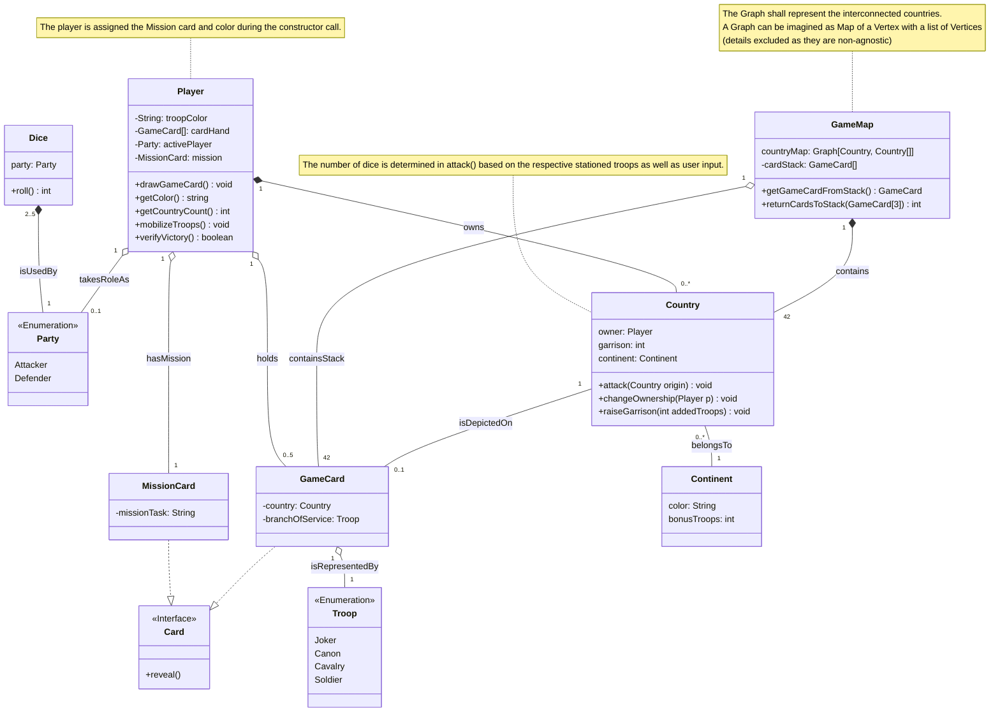

```mermaid {scale: 0.4}
%% Klassen
classDiagram
    note for Player "The player is assigned the Mission card and color during the constructor call."
    class Player{
        -String: troopColor
        -GameCard[]: cardHand
        -Party: activePlayer
        -MissionCard: mission

        +drawGameCard() void
        +getColor() string
        +getCountryCount() int
        +mobilizeTroops() void
        +verifyVictory() boolean
    }

    class Card{
        <<Interface>>
        +reveal()
    }

    class MissionCard{
        -missionTask: String
    }

    class GameCard {
        -country: Country
        -branchOfService: Troop
    }

    class Troop{
        <<Enumeration>>
        Joker
        Canon
        Cavalry
        Soldier
    }

    class Party{
        <<Enumeration>>
        Attacker
        Defender
    }

    class Dice{
        party: Party
        +roll() int
    }

    class GameMap{
        countryMap: Graph[Country, Country[]]
        -cardStack: GameCard[]

        +getGameCardFromStack() GameCard
        %% Returns the number of granted troops through the deal in of the cards. Returns 0 if the handed in Cards won't grant any troops.
        +returnCardsToStack(GameCard[3]) int
    }

    class Country{
        owner: Player
        %% Garnision -> Anzahl der stationierten Truppen
        garrison: int
        continent: Continent

        +attack(Country origin) void
        +changeOwnership(Player p) void
        +raiseGarrison(int addedTroops) void
    }

    class Continent {
        color: String
        bonusTroops: int
    }
    %% Assoziazionen

    %% Ein Land gehört immer genau einem Spieler, und ein Spieler kann viele Länder besitzen. Wenn der Spieler eliminiert wird, müssen die Länder neu zugewiesen werden.
    Player "1" *-- "0..*" Country : owns
    Player "1" o-- "1" MissionCard : hasMission
    %% Ein Spieler hat beliebig viele (oder keine) Karten auf der Hand.
    Player "1" o-- "0..5" GameCard : holds
    MissionCard ..|> Card
    GameCard ..|> Card
    GameCard "1" o-- "1" Troop : isRepresentedBy
    %% Eine Gamemap hat immer 42 Länder und ein Land exestiert immer nur in abhängigkeit zu einer GameMap
    GameMap "1" *-- "42" Country : contains
    %% Der Kartenstapel (-cardStack) ist ein Bestandteil der Karte und hat alle 42 Karten.
    GameMap "1" o-- "42" GameCard : containsStack
    Country "0..*" -- "1" Continent : belongsTo
    %% Country "1" -- "0..*" Country : isAdjacentTo // Könnte man als Graph modellieren sodass auf einem Blick klar wird das Länder miteinander verbunden sind. Auch wenn die eigentliche Logik in GameMap Graph {} liegt.
    Country "1" -- "0..1" GameCard : isDepictedOn
    Dice "2..5" *-- "1" Party : isUsedBy
    Player "1" o-- "0..1" Party : takesRoleAs

    %% Notes
    note for Game Map "The Graph shall represent the interconnected countries.
    A Graph can be imagined as Map of a Vertex with a list of Vertices
    (details excluded as they are non-agnostic)"

    note for Country "The number of dice is determined in attack() based on the respective stationed troops as well as user input."
```
