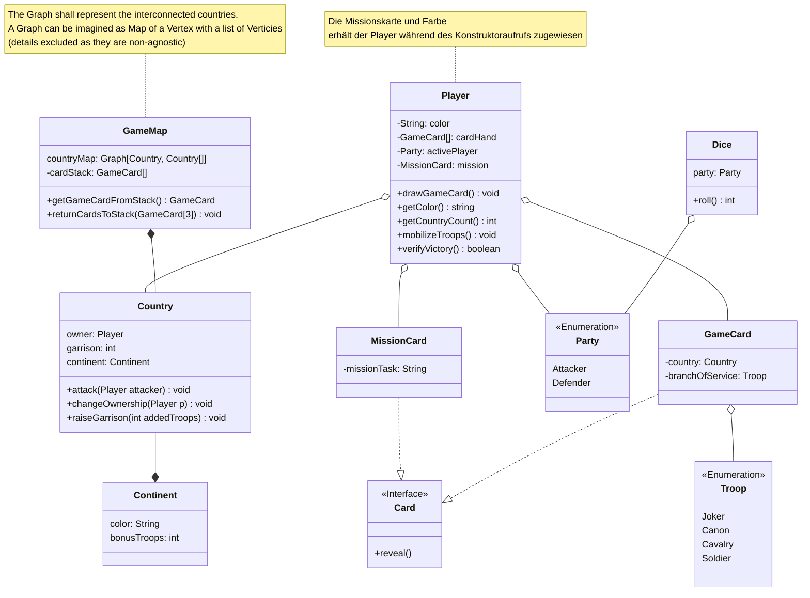

# Risiko - Klassendiagramm

```mermaid
%% TODO: Kardinalitäten
%% Klassen
classDiagram
    note for Player "Die Missionskarte und Farbe
    erhält der Player während des Konstruktoraufrufs zugewiesen"
    class Player{
        -String: color
        -GameCard[]: cardHand
        -Party: activePlayer
        -MissionCard: mission

        +drawGameCard() void
        +getColor() string
        +getCountryCount() int
        +mobilizeTroops() void
        +verifyVictory() boolean
    }

    class Card{
        <<Interface>>
        +reveal()
    }

    class MissionCard{
        -missionTask: String
    }

    class GameCard {
        -country: Country
        -branchOfService: Troop
    }

    class Troop{
        <<Enumeration>>
        Joker
        Canon
        Cavalry
        Soldier
    }

    class Party{
        <<Enumeration>>
        Attacker
        Defender
    }

    class Dice{
        party: Party
        +roll() int
    }

    class GameMap{
        countryMap: Graph[Country, Country[]]
        -cardStack: GameCard[]

        +getGameCardFromStack() GameCard
        +returnCardsToStack(GameCard[3]) void
    }

    class Country{
        owner: Player
        %% Garnision -> Anzahl der stationierten Truppen
        garrison: int
        continent: Continent

        +attack(Player attacker) void
        +changeOwnership(Player p) void
        +raiseGarrison(int addedTroops) void
    }

    class Continent {
        color: String
        bonusTroops: int
    }
    %% Assoziazionen
    Player o-- Party
    Player o-- Country
    Player o-- MissionCard
    Player o-- GameCard
    MissionCard ..|> Card
    GameCard ..|> Card
    GameCard o-- Troop
    GameMap *-- Country
    Country --* Continent
    Dice o-- Party

    %% Notes
    note for Game Map "The Graph shall represent the interconnected countries.
    A Graph can be imagined as Map of a Vertex with a list of Verticies
    (details excluded as they are non-agnostic)"
```
