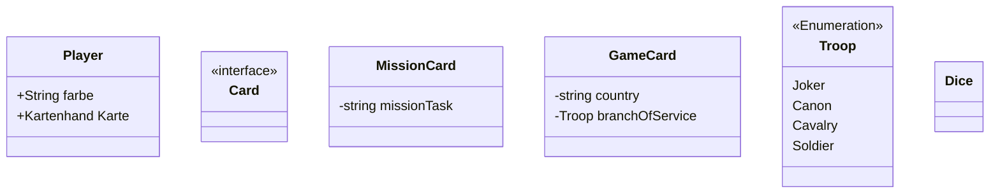

# Class Diagram

```mermaid
classDiagram
    class Player{
        +String farbe
        +Kartenhand Karte
    }
    class Card{
        <<interface>>
    }
    class MissionCard{
        -string missionTask
    }
    class GameCard {
        -string country
        -Troop branchOfService
    }

    class Troop{
        <<Enumeration>>
        Joker
        Canon
        Cavalry
        Soldier
    }

    class Dice{

    }
```
