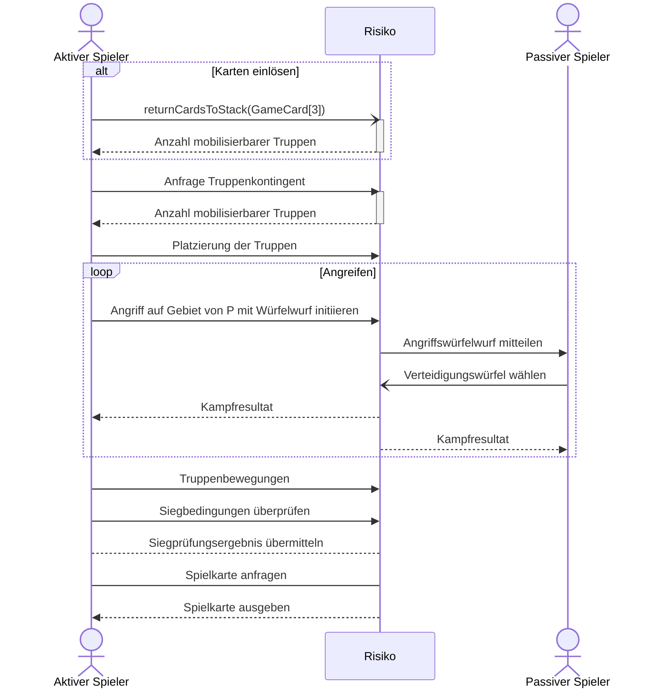

# Risiko - Sequenzdiagramm

## Spielzug

```mermaid
sequenceDiagram
        actor A as Aktiver Spieler
        participant R as Risiko
        actor P as Passiver Spieler

        alt Karten einlösen
        A-)R: returnCardsToStack(GameCard[3])
        activate R
        R-->>A: Anzahl mobilisierbarer Truppen
        deactivate R
        end
        A->>R: Anfrage Truppenkontingent
        activate R
        R-->>A: Anzahl mobilisierbarer Truppen
        deactivate R
        A->>R: Platzierung der Truppen

        %%Kampfphase
        loop Angreifen
        A->>R: Angriff auf Gebiet von P mit Würfelwurf initiieren
        R->>P: Angriffswürfelwurf mitteilen
        P-)R: Verteidigungswürfel wählen
        R-->>A: Kampfresultat
        R-->>P: Kampfresultat
        end


        %% Aufräumphase
        A->>R: Truppenbewegungen
        A->>R: Siegbedingungen überprüfen
        R-->A: Siegprüfungsergebnis übermitteln
        A->R: Spielkarte anfragen
        R-->>A: Spielkarte ausgeben
```
