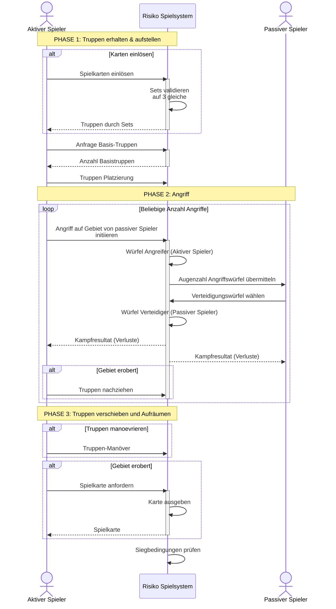

# Risiko - Sequenzdiagramm

## Spielzug

```mermaid
sequenceDiagram
    actor A as Aktiver Spieler
    participant R as Risiko Spielsystem
    actor P as Passiver Spieler
    
%% Truppen erhalten & aufstellen
    Note over A,R: PHASE 1: Truppen erhalten & aufstellen
    alt Karten einlösen
        A->>R: Spielkarten einlösen
        activate R
        R->>R: Sets validieren <br> auf 3 gleiche
        R-->>A: Truppen durch Sets
        deactivate R
    end

    A->>R: Anfrage Basis-Truppen
    activate R
    R-->>A: Anzahl Basistruppen
    deactivate R

    A->>R: Truppen Platzierung


%%Angreifen auf Gebiet von passiever Spiel
    Note over A,P: PHASE 2: Angriff
    loop Beliebige Anzahl Angriffe
        A->>R: Angriff auf Gebiet von passiver Spieler <br> initiieren
        activate R

        R->>R: Würfel Angreifer (Aktiver Spieler)
        R->>P: Augenzahl Angriffswürfel übermitteln
        P->>R: Verteidigungswürfel wählen
        R->>R: Würfel Verteidiger (Passiver Spieler)


        R-->>A: Kampfresultat (Verluste)
        R-->>P: Kampfresultat (Verluste)

        alt Gebiet erobert
            A->>R: Truppen nachziehen
        end

        deactivate R
    end

%%Truppen verschieben und Aufräumen
    Note over A,R: PHASE 3: Truppen verschieben und Aufräumen
    alt Truppen manoevrieren
        A->>R: Truppen-Manöver
    end
    alt Gebiet erobert
        A->>R: Spielkarte anfordern
        activate R
        R->>R: Karte ausgeben
        R-->>A: Spielkarte
        deactivate R
    end

    R->>R: Siegbedingungen prüfen
```
