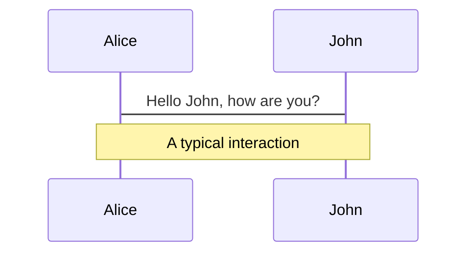
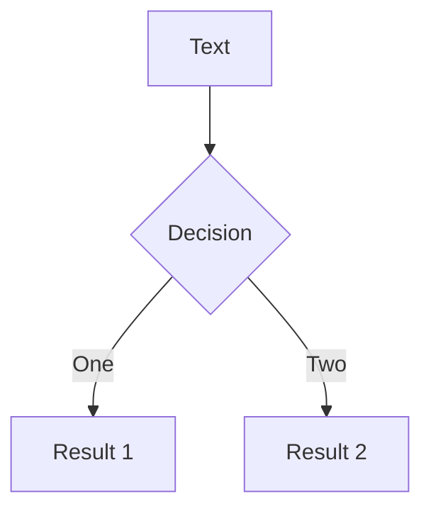
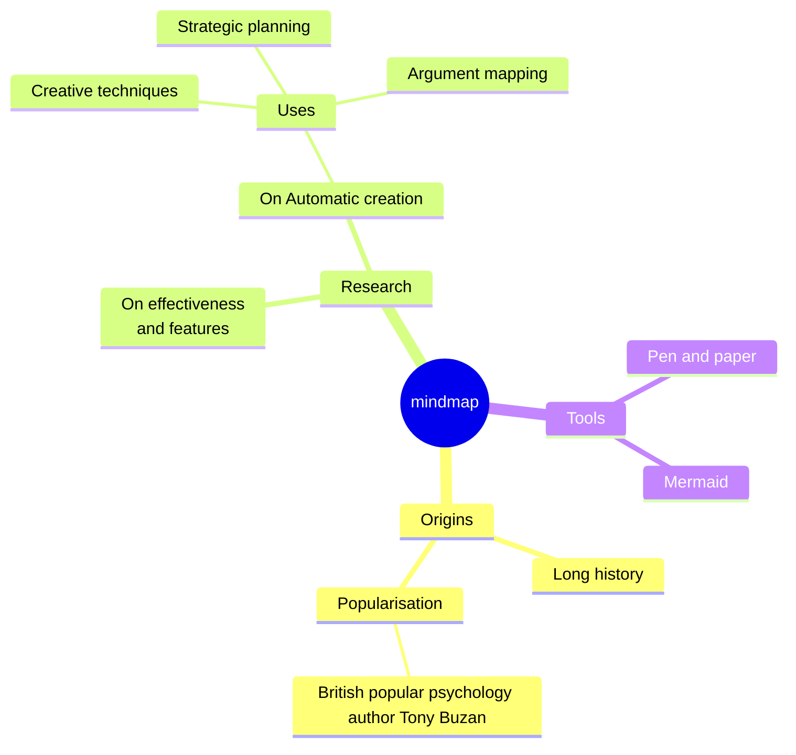
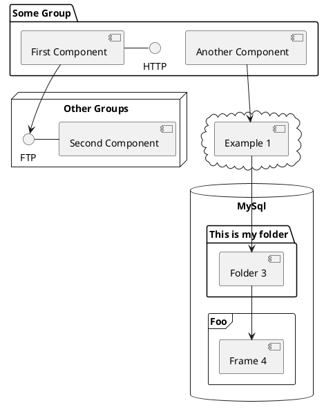

---
# try also 'default' to start simple
theme: ./theme
# random image from a curated Unsplash collection by Anthony
# like them? see https://unsplash.com/collections/94734566/slidev
background: /risiko-thumbnail.png
# some information about your slides (markdown enabled)
title: Risiko
info: |
  ## Systemmodellierung des Brettspielklassikers Risiko
  Portfolio in **Kernkonzepte und Methoden des Software-Engineering**
# apply UnoCSS classes to the current slide
class: text-center
# https://sli.dev/features/drawing
drawings:
  persist: false
# slide transition: https://sli.dev/guide/animations.html#slide-transitions
transition: slide-left
# enable MDC Syntax: https://sli.dev/features/mdc
mdc: true
# duration of the presentation
duration: 35min
---

# Systemmodellierung des Brettspielklassikers Risiko

Portfolio in **Kernkonzepte und Methoden des Software-Engineering**

<div @click="$slidev.nav.next" class="mt-12 py-1" hover:bg="white op-10">
  <carbon:arrow-right />
</div>

<div class="abs-br m-6 text-xl">
  <button @click="$slidev.nav.openInEditor()" title="Open in Editor" class="slidev-icon-btn">
    <carbon:edit />
  </button>
  <a href="https://github.com/Raqhael/risiko-engineering" target="_blank" class="slidev-icon-btn">
    <carbon:logo-github />
  </a>
</div>

<!--
The last comment block of each slide will be treated as slide notes. It will be visible and editable in Presenter Mode along with the slide. [Read more in the docs](https://sli.dev/guide/syntax.html#notes)
-->

---

# Inhaltsverzeichnis

<Toc text-sm minDepth="1" maxDepth="2" />


---
src: ../APPLICATION_LIMITS.md
hide: false
---

---
src: ../ACTORS.md
hide: false
---

---
src: ../SEQUENCEDIAGRAMM.md
hide: false
---

---
layout: section
---

# Anwendungsfälle

---
src: ../UseCases/1_Spiel-starten.md
hide: false
---

---
src: ../UseCases/2_Truppenmobilisierung.md
hide: false
---

---

## Kampfphase

<table>
    <tbody>
      <tr>
          <td>Geschäftsprozess, Funktion</td>
          <td>Kampfphase durchführen</td>
      </tr>
      <tr>
          <td>Ziel, Ergebnisse</td>
          <td>Der aktive Spieler versucht, mit seinen Truppen aus seinen bestehenden Ländern benachbarte Spieler anzugreifen, um deren Länder zu erobern.</td>
      </tr>
      <tr>
          <td>Akteure</td>
          <td>Aktiver Spieler, Passiver Spieler</td>
      </tr>
      <tr>
          <td>Vorbedingungen</td>
          <td>Die Truppen des aktiven Spielers wurden mobilisiert. Im Angriffsquellland des aktiven Spielers befindet sich mehr als eine Truppe.</td>
      </tr>
      <tr>
          <td>Auslösendes Ereignis</td>
          <td>Abschluss der Truppenmobilisierungsphase.</td>
      </tr>
      <tr>
          <td>Nachbedingung bei Erfolg</td>
          <td>Der aktive Spieler hat mindestens ein Land erobert</td>
      </tr>
      <tr>
          <td>Nachbedingung bei Fehlschlag</td>
          <td>Der aktive Spieler hat <i>kein</i> Land erobert, aber mindestens 1 Truppe verloren</td>
      </tr>
      <tr>
          <td>Eingehende Daten</td>
          <td>Würfelwurf von aktivem und verteidigendem Spieler</td>
      </tr>
      <tr>
          <td>Ausgehende Daten</td>
          <td>Truppenverluste der kämpfenden Spieler (mind. 1 Truppe pro erfolgreicher Eroberung wird verloren)</td>
      </tr>
      <tr>
          <td>Ablauf</td>
          <td>
          <span v-mark.box.red="1">
          1. Der aktive Spieler proklamiert das Zielland und das Angriffsquellland, aus welchem er angreift. <br> 2. Der aktive Spieler würfelt mit den Angriffswürfeln, wobei die genaue Anzahl dieser Würfel [n ∈ {1,2,3}] Teil eines separaten Anwendungsfalls ist. <br> 3. Der passive Spieler würfelt mit den Verteidigungswürfeln, wobei die genaue Anzahl dieser Würfel [n ∈ {1,2}] Teil eines separaten Anwendungsfalls ist. <br> 4. Die Ergebnisse der Würfe werden abgeglichen und der jeweils schlechtere Spieler verliert 1 Truppe pro Niederlage. <br> 5. Schritte 2-4 werden wiederholt, bis alle Truppen im Zielland vernichtet wurden - der aktive Spieler erobert das Land, der aktive Spieler nicht mehr über genügend Truppen im Angriffsquellland verfügt oder keine weiteren Angriffe durchführen möchte. Es folgt ein Wechsel von Angriffsquell-/-zielland oder die nächste Zugphase.
          </span>
          </td>
      </tr>
      <tr>
          <td>Erweiterungen</td>
          <td>1. Berechnung der maximal erlaubten Würfel pro Spieler. <br> 2. Auswahl der zu werfenden Würfel durch die Spieler.</td>
      </tr>
      <tr>
          <td>Alternativen</td>
          <td>Durch die vorgeschaltete Truppenmobilisierungsphase ist sichergestellt, dass der Spieler technisch betrachtet <b>immer</b> daran angeschlossen die Kampfphase durchführen kann. Dennoch ist es ihm möglich, (aus taktischen Gründen) auf eine Durchführung des Anwendungsfalls Kampfphase zu verzichten und direkt zur Folgephase Zug abschließen überzugehen.</td>
      </tr>
    </tbody>
</table>

---
src: ../UseCases/4_Zug-abschliessen.md
hide: false
---

---
src: ../UseCases/5_Siegbedingungen-pruefen.md
hide: false
---

---
layout: section
---

# Klassendiagramm


---
src: ../CLASSDIAGRAM.md
hide: false
---

---
src: ../DATA_DICTIONARY.md
hide: false
---

---
layout: section
---

# Zusammenarbeit

---

## Kanban Board


---

## Git Repository


<!--Mermaid, Markdown & Slidev (Slides mit HTML/CSS)-->

---
layout: two-cols
---

## CI/CD Pipeline

```yml {all|35-37}{lines:true, startLine:17}
jobs:
  build:
    runs-on: ubuntu-latest

    steps:
      - uses: actions/checkout@v4

      - uses: actions/setup-node@v4
        with:
          node-version: 'lts/*'

      - name: Setup @antfu/ni
        run: npm i -g @antfu/ni

      - name: Install dependencies
        working-directory: slides
        run: nci

      - name: Build
        working-directory: slides
        run: nr build --base /${{ github.event.repository.name }}/
```


---
hide: true
---

# Clicks Animations

You can add `v-click` to elements to add a click animation.

<div v-click>

This shows up when you click the slide:

```html
<div v-click>This shows up when you click the slide.</div>
```

</div>

<br>

<v-click>

The <span v-mark.red="3"><code>v-mark</code> directive</span>
also allows you to add
<span v-mark.circle.orange="4">inline marks</span>
, powered by [Rough Notation](https://roughnotation.com/):

```html
<span v-mark.underline.orange>inline markers</span>
```

</v-click>

<div mt-20 v-click>

[Learn more](https://sli.dev/guide/animations#click-animation)

</div>


---
hide: true
---

# LaTeX

LaTeX is supported out-of-box. Powered by [KaTeX](https://katex.org/).

<div h-3 />

Inline $\sqrt{3x-1}+(1+x)^2$

Block
$$ {1|3|all}
\begin{aligned}
\nabla \cdot \vec{E} &= \frac{\rho}{\varepsilon_0} \\
\nabla \cdot \vec{B} &= 0 \\
\nabla \times \vec{E} &= -\frac{\partial\vec{B}}{\partial t} \\
\nabla \times \vec{B} &= \mu_0\vec{J} + \mu_0\varepsilon_0\frac{\partial\vec{E}}{\partial t}
\end{aligned}
$$

[Learn more](https://sli.dev/features/latex)

---
hide: true
---

# Diagrams

You can create diagrams / graphs from textual descriptions, directly in your Markdown.

<div class="grid grid-cols-4 gap-5 pt-4 -mb-6">









</div>

Learn more: [Mermaid Diagrams](https://sli.dev/features/mermaid) and [PlantUML Diagrams](https://sli.dev/features/plantuml)


---
layout: center
class: text-center
---

# Learn More

[Documentation](https://sli.dev) · [GitHub](https://github.com/slidevjs/slidev) · [Showcases](https://sli.dev/resources/showcases)

<PoweredBySlidev mt-10 />
